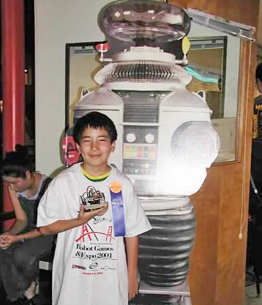

We are thrilled to announce the newest member of our AICell Lab family, Dr. Gabriel Reder, who joins us as a Postdoc Researcher. Gabe brings a wealth of expertise in computational biology, automated scientific discovery, AI, simulation, lab robotics, and mass spectrometry metabolomics.

## About Gabriel

Born and raised in San Francisco, Gabe earned his PhD in Bioengineering from Stanford University after a Master’s degree in Applied Mathematics from Columbia University and an AB in Computer Science from Princeton University. Prior to joining AICell, he worked at Chalmers University in Sweden, focusing on robotic automation in scientific research.

Gabe is passionate about the intersection of computational biology and laboratory automation. He aims to use his expertise to ease the process of making new discoveries and improve the quality of life for many. He is especially eager to work with high-throughput microscopy data at AICell Lab.

### Research Interests

- Automated scientific discovery
- Computational biology
- AI
- Simulation
- Lab robotics
- Mass spectrometry metabolomics

### Personal Interests

- Drawing
- Digital art
- Traveling
- Cooking
- American football

## What Will Gabe Work On at the AICell Lab?

Gabe will be a key contributor to our cutting-edge automated imaging farm, REEF. The ultimate goal is to create a fully automated, intelligent system that will redefine how we conduct biological imaging. He will explore the integration of large language models like ChatGPT and autonomous agents augmented by specialized knowledge bases. These advanced technologies aim to automate the entire biological imaging workflow, from formulating scientific hypotheses and crafting experimental plans to executing them on our imaging farm. Beyond mere automation, Gabe's work will pave the way for fully autonomous agents capable of data collection and analysis, report generation, and even driving subsequent experiments based on findings. This ambitious project promises to be a cornerstone in our ongoing efforts to revolutionize data-driven life sciences.

## Get to Know Gabe Better: An Interview

### Could you provide a brief background about where you come from, where you have studied, where you got your previous degree, and if you have some other merit that you want to mention?

> I was born and raised in San Francisco, moved to the Northeast for university studies, returned to the Bay Area for my PhD at Stanford, and most recently lived in Göteborg, working at Chalmers University.

### How do you think your expertise fits into the AICell Lab?

> Hopefully smoothly! I see lots of overlaps between the lab's mission, the expertise of its members, and my background. I've spent the last few years working on the automation of biology labs, combining AI, informatics, lab robotics, and high-throughput mass spectrometry.

### What would you like to study/learn and work on at the AICell Lab?

> I'd like to continue exploring and refining the automation of life sciences research. I'm interested in how to best use robots for experiments, analytical instruments for measurements, and computational techniques for automatically extracting insights.

### Name one thing that people generally do not know about you.

> I grew up speaking Portuguese at home.

### How do you think the upcoming experience at the AICell Lab will contribute to your career development?

> It'll be invaluable to be around such a mix of experiences, techniques, and people.

### In one word, describe how you feel about becoming a member of the AICell Lab.

> Euphoric.

### If you could have dinner with any scientist, past or present, who would it be and why?

> Niels Bohr. He wasn't just a genius but also a kind and interesting person. And he knew how to enjoy life!

---

Feel free to reach out to Gabe for potential collaborations or inquiries. Here you can find more information about [Gabe](https://aicell.io/authors/gabriel/).

Please join us in extending a warm welcome to Gabe Reder! We're excited to see the contributions he will make to AICell Lab and the scientific community.

---

### Acknowledgments

This post was co-edited with the assistance of ChatGPT, a conversational agent trained by OpenAI.
