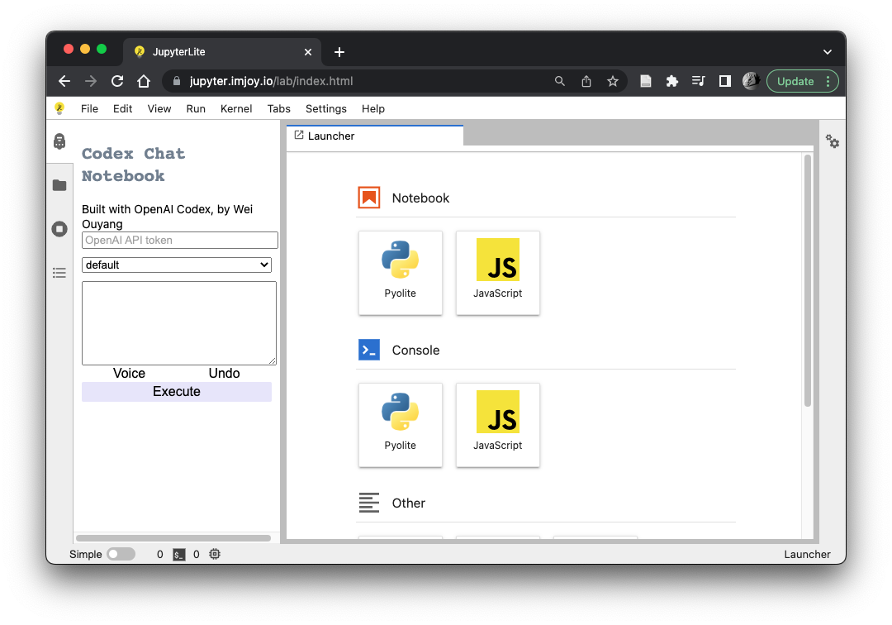

Deep learning has already revolutionized the way we do image analysis, now it comes the latest AI models for natural language processing which will change the way we interact with bioimage analysis software. 

Here is an Open AI codex demo showing how one can generate Python code from English for bioimage analysis including cellpose segmentation, feature extraction and plotting!

Watch the video here: 
<iframe width="100%" height="400px" src="https://www.youtube.com/embed/pkOp_oUybsc" title="YouTube video player" frameborder="0" allow="accelerometer; autoplay; clipboard-write; encrypted-media; gyroscope; picture-in-picture; web-share" allowfullscreen></iframe>

This type of code generation technology is ideally suited for users without programming skills, and provides a solution for building simple interface for complex scientific software. It enables us to build next generation software that are powerful, flexible, but with only very simple speech or text prompt interface. 

It can completely change how software tools are delivered to the users. Since the codex model can read developer document and generate code based on the documentation, developers can focus on making reusable library and forget about the GUI part. For each bioimage anlysis task, we can provide a prompt (a chunk of text with hint on how to perform a certain task) and user can then use English or other natural language to send instruction to perform the analysis task. During the code generation, reusable UI components such as jupyter widgets, [ImJoy](/project/imjoy) plugins or napari can be used to provide rich interaction. 

The key difference compared to conventional software design is that the code are generated on the fly, and it effectively makes the user (without programming skills) a developer and makes the software more generalizable for more applications. In addition, the generated software can be reused and published, for example, one can easily generate napari or [ImJoy](/project/imjoy) plugins with codex model. 

However, as of now, the Codex model remains a black box and we do not have an actual way of controlling the code generation process besides the prompt and instructions. As a result, the generated code are not always correct and safe to run on the user's computer (e.g. it might accidentally remove all the data). Therefore, it is safer to run it in a sandbox environment, e.g. in the browser or docker containers. 

On the other hand, [ImJoy](/project/imjoy) is ideally suited for working with AI generated code because every ImJoy plugin runs in its own sandbox environment and it is easy enough to contain AI generate code that might go wrong seriously. Within the #ImJoy team, we are currently developing a new interface based on Codex code generation. The new interface will be accessible from a web browser and connected to a cloud infrastructure that allows multi-model serving, data management and serverless app hosting.

In the AICell Lab, we developed the Codex Chat Notebook which aims to use OpenAI Codex to generate python code for image analysis and beyond. The project is currented hosted at: https://github.com/oeway/codex-chat-notebook.

If you have an OpenAI api token (get it from [here](https://openai.com/blog/openai-codex/)), you can already try it out with our Jupyter notebook running in the browser: https://jupyter.imjoy.io/lab/index.html 
